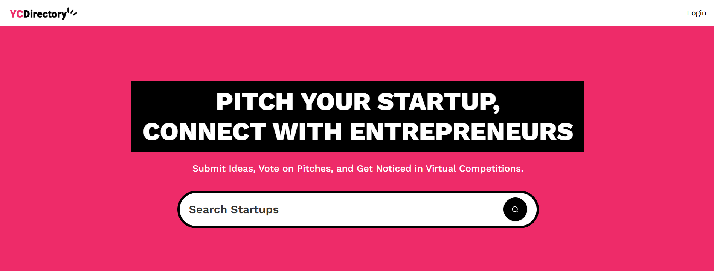

<div align="center">
    
</div>

<br/>

<div align="center">
    
    
    
    
</div>

<div align="center">
    <h3>Startup Directory Platform</h3>
</div>

---

## Introduction
A Next.js 15 platform where entrepreneurs can submit their startup ideas for virtual pitch competitions, browse other pitches, and gain exposure through a clean minimalistic design for a smooth user experience.

## Tech Stack
- React 19
- Next.js 15
- Sanity
- TailwindCSS
- ShadCN
- TypeScript

## Features
- **Live Content API**: Displays the latest startup ideas dynamically on the homepage using Sanity's Content API.
- **Github Authentication**: Allows users to log in easily using their GitHub account.
- **Pitch Submit**: Users can submit startup ideas, including title, description, category, and multimedia links ( image or video).
- **View Pitches**: Browse through submitted ideas with filtering options by category.
- **Pitch Details Page**: Click on any pitches to view its details, with multimedia and description displayed.
- **Profile Page**: Users can view the list of pitches they're submitted.
- **Editor Picks**: Admins can highlight top startup ideas using the "Editor Picks" feature managed via Sanity Studio.
- **Views Counter**: Tracks the number of views for each pitch instead of an upvote system.
- **Search**: Search functionality to load and view pitches efficiently.
- **Minimalistic Design**: Fresh and simple UI with only the essential pages for ease of use and a clean aesthetic.

and many more, including the latest **React 19, Next.js 15** and **Sanity** features alongside code architecture and reusability.

## Quick Start
Admins can highlight top startup ideas using the "Editor Picks" feature managed via Sanity Studio.

**Prerequisites**

Make sure you have the following installed on your machine:

- [Git](https://git-scm.com/)
- [Node.js](https://nodejs.org/en)
- [npm](https://www.npmjs.com/)(Node Package Manager)

**Cloning the Repository**

```bash
git clone https://github.com/conbopk/yc_directory.git
cd yc_directory
```

**Installation**

Install the project dependencies using npm:

```bash
npm install
```

**Set Up Environment Variables**

Create a new file named .env.local in the root of your project and add the following content:
```bash
NEXT_PUBLIC_SANITY_PROJECT_ID=
NEXT_PUBLIC_SANITY_DATASET=
NEXT_PUBLIC_SANITY_API_VERSION='vX'
SANITY_WRITE_TOKEN=
SENTRY_AUTH_TOKEN=

AUTH_SECRET= 
AUTH_GITHUB_ID=
AUTH_GITHUB_SECRET=
```

Replace the placeholder values with your actual Sanity credentials. You can obtain these credentials by signing up & creating a new project on the [Sanity website](https://www.sanity.io/).

**Running the Project**
```bash
npm run dev
```

Open http://localhost:3000 in your browser to view the project.

